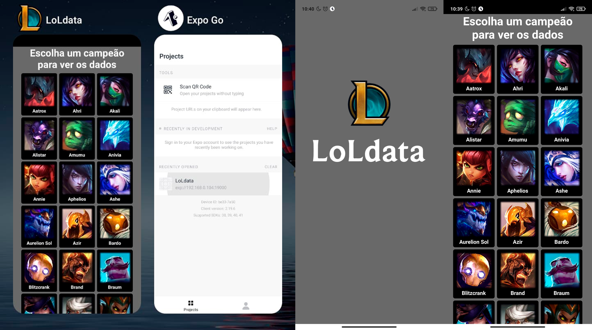

# 
# App para visualização de dados dos campeões de League of Legends
### Criado a partir dos meus estudos em React Native
## Tecnologias Utilizadas:
|HTML|CSS|JavaScript|React Native|
|-|-|-|-|
|||||
|Sintaxe JSX|Utilizado na estilização dos componentes|Aplicação das funcionalidades com o React Native|Utilização dos Core components do React Native|
___

